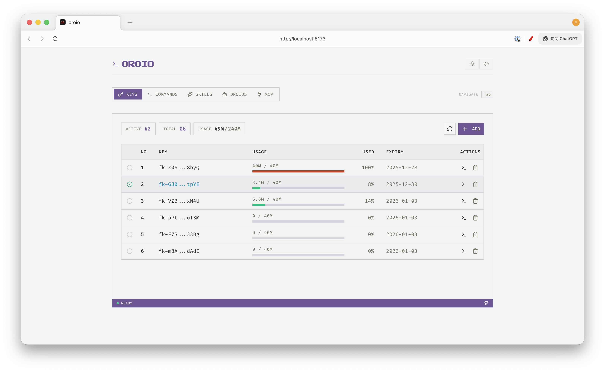
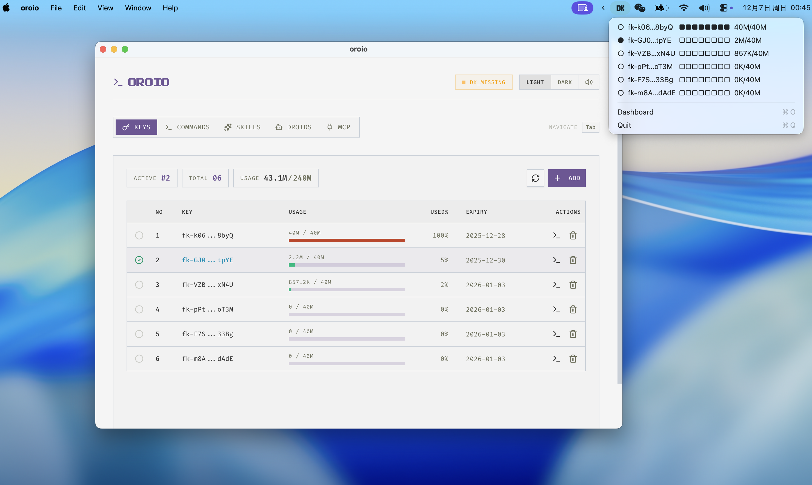

# oroio

**轻量级 CLI，用于管理 Factory Droid API 密钥，支持自动轮换。**

[English](README.md)

## dk 是什么？

dk 集中管理多个 Factory Droid API 密钥，实时追踪用量和到期时间。当一个密钥额度耗尽时自动切换到下一个可用密钥，让你的 AI 编程会话不中断。

### 适用场景

- **重度 Droid 用户** — 管理多个 API 密钥，无需手动切换
- **团队环境** — 跨设备共享密钥池
- **不间断工作流** — 自动轮换保持会话持续运行

## 快速开始

### 安装

**macOS / Linux：**

```bash
curl -fsSL https://raw.githubusercontent.com/notdp/oroio/main/install.sh | bash
```

**Windows (PowerShell)：**

```powershell
irm https://raw.githubusercontent.com/notdp/oroio/main/install.ps1 | iex
```

安装程序会在 shell 中添加 `droid` 函数。重启终端后直接运行 `droid` 即可。

### 基本用法

```bash
# 1. 添加 API 密钥
dk add fk-xxxx fk-yyyy fk-zzzz

# 或从文件导入（每行一个密钥）
dk add --file keys.txt

# 2. 查看用量和到期时间
dk list

# 3. 运行 droid（自动注入密钥，额度耗尽时自动轮换）
droid
```

`dk list` 效果如下：


## 命令

| 命令                   | 说明                             |
| ---------------------- | -------------------------------- |
| `dk add <key...>`      | 添加一个或多个 API 密钥          |
| `dk add --file <路径>` | 从文件导入密钥                   |
| `dk list`              | 显示所有密钥的用量和到期时间     |
| `dk current`           | 显示当前密钥并复制 export 命令   |
| `dk use <序号>`        | 按序号切换密钥                   |
| `dk rm <序号...>`      | 按序号删除密钥                   |
| `dk run <命令>`        | 使用当前密钥运行命令（自动轮换） |
| `dk serve`             | 启动 Web 控制台（端口 7758）     |
| `dk reinstall`         | 更新到最新版本                   |
| `dk uninstall`         | 卸载 dk                          |

## Web 控制台

```bash
dk serve        # 启动控制台
dk serve stop   # 停止控制台
dk serve status # 检查运行状态
```

访问 `http://localhost:7758` 可视化查看和管理密钥。



## 桌面应用（可选）

提供适用于 macOS、Windows 和 Linux 的独立桌面应用。具备相同的控制台功能，并支持系统托盘和余额不足提醒。

从 [Releases](https://github.com/notdp/oroio/releases/tag/electron-dist) 下载。

> **macOS**：安装后运行 `xattr -cr /Applications/oroio.app` 以绕过 Gatekeeper（应用未签名）。
>
> **注意**：桌面应用可独立管理密钥。如需在终端使用 `droid`，请单独安装 CLI。



## 安装详情

### 安装内容

**macOS / Linux：**
- 可执行文件：`~/.local/bin/dk`
- 数据目录：`~/.oroio/`
- Shell 别名：`droid` → `dk run droid`

**Windows：**
- 脚本：`%LOCALAPPDATA%\oroio\bin\dk.ps1`
- 数据目录：`%USERPROFILE%\.oroio\`
- PowerShell 函数：`droid` → `dk run droid`

### 更新

```bash
dk reinstall
```

或手动执行：
```bash
curl -fsSL https://raw.githubusercontent.com/notdp/oroio/main/reinstall.sh | bash    # macOS/Linux
irm https://raw.githubusercontent.com/notdp/oroio/main/reinstall.ps1 | iex           # Windows
```

### 卸载

```bash
dk uninstall
```

或手动执行：
```bash
curl -fsSL https://raw.githubusercontent.com/notdp/oroio/main/uninstall.sh | bash    # macOS/Linux
irm https://raw.githubusercontent.com/notdp/oroio/main/uninstall.ps1 | iex           # Windows
```

---

**告别密钥切换的烦恼，专注编写代码。**
